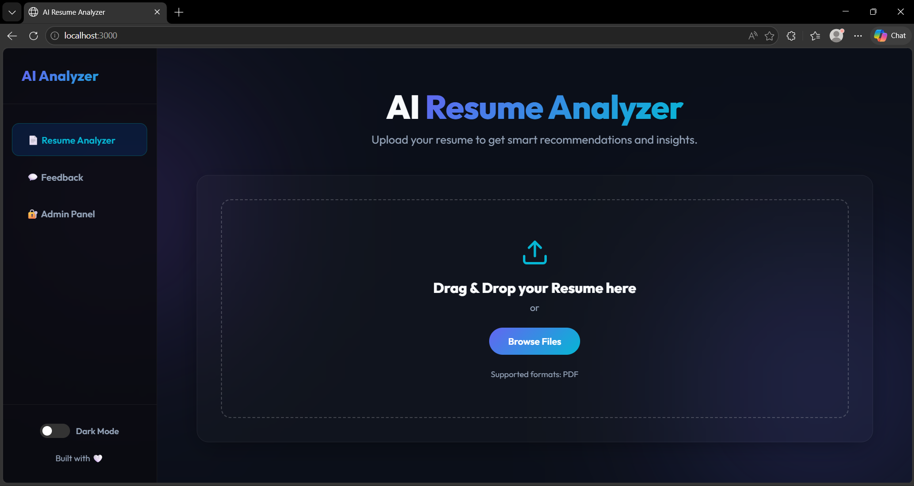

# AI RESUME ANALYZER

## Tech Stack 
*   **Frontend:** Streamlit, HTML, CSS, JavaScript
*   **Backend:** Streamlit, Python
*   **Database:** MySQL
*   **Modules:** pandas, pyresparser, pdfminer3, Plotly, NLTK

## Features
### Client
*   **Parsing Capabilities:** Fetches Basic Info, Skills, and Keywords from the uploaded resume.
*   **Logic & Recommendations:** Predicts job roles and recommends skills to add, courses/certificates, resume tips, an overall score, and interview/resume tip videos.
*   **Data Collection:** Fetches location and miscellaneous data.

### Admin
*   **Data Management:** View applicant data in a tabular format, download user data as a CSV file, and access all saved uploaded PDFs.
*   **Feedback Management:** Access user feedback and ratings.
*   **Analytics (Pie Charts):** Visual representations for ratings, predicted fields/roles, experience levels, resume scores, user counts, and geographical data (City, State, Country).

### Feedback
*   Feedback form with a 1–5 rating system.
*   Displays an overall ratings pie chart and past user comment history.

---

## Screenshots

**Homepage**


**Analysis Results**


**Career Insights**


**Final Insights**


**Admin Dashboard**


**User Feedback**


---

## Requirements
To run this project smoothly, ensure you have the following installed:
1. Python (3.9.12)
2. MySQL
3. Visual Studio Code (Preferred Code Editor)
4. Visual Studio build tools for C++

---

## Setup & Installation

**1. Download the code** manually or via git:
```bash
git clone <your-repository-url>
```

**2. Create a virtual environment and activate it** (Recommended):
Open your command prompt, navigate to your project directory, and run:
```bash
python -m venv venvapp
cd venvapp/Scripts
activate
```

**3. Install Packages:**
Navigate to the `App` folder and install the dependencies from `requirements.txt`:
```bash
cd ../..
cd App
pip install -r requirements.txt
python -m spacy download en_core_web_sm
```

**4. Database Setup:**
*   Create a MySQL Database named `cv`.
*   Change the database user credentials inside `App.py` to match your local MySQL setup.

**5. Patching Pyresparser:**
*   Navigate to your virtual environment's site-packages folder: `venvapp\Lib\site-packages\pyresparser`
*   Replace the existing `resume_parser.py` file with the custom `resume_parser.py` provided in the project files.

**6. Run the Application:**
Ensure your virtual environment is activated and your working directory is inside the `App` folder, then execute:
```bash
streamlit run App.py
```

---

## Known Errors & Troubleshooting
*   **`GeocoderUnavailable` Error:** If this pops up, simply check your internet connection and network speed. 

## Usage
*   Once running, the application automates the analysis process.
*   Upload a resume (PDF format) on the client side to view the recommendations.
*   **Admin Access:** The default userid is `admin` and the password is `admin@resume-analyzer`.
